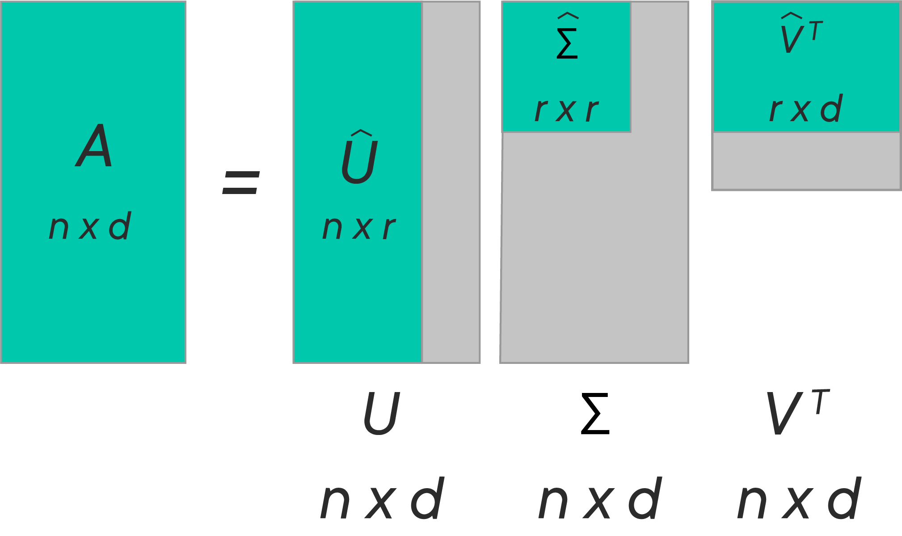

# Collaborative Filtering with Singular Value Decomposition

## Introduction

Recommendation Systems apply IR (Information Retrieval techniques) to select some information relevant to a given user. __Collaborative Filtering (CF)__ is currently the most widely used approach to build recommendation systems and uses the users’ behavior in the form of user-item ratings for predictions. CF often uses __Matrix Factorization (MF)__ under the hood. In this lesson, we will look at an overview of the role of the Matrix Factorization model to address the implementation of CF with __Singular Value Decomposition (SVD)__.

## Objectives

You will be able to:

- Compare and contrast the advantages/disadvantages of memory vs. model-based recommender systems 
- Describe how memory-based collaborative filtering methods work 
- Describe how model-based collaborative filtering models work 
- Explain how SVD is able to extract meaning with latent factors 
- Implement SVD using SciPy 

## Collaborative Filtering

Collaborative filtering is a method of making automatic predictions (i.e. filtering) about the interests of a user by collecting preferences or taste information from many users on the aggregate (i.e. collaborating). There are two main approaches to collaborative filtering that we will learn about. The basic idea behind collaborative filtering model is:

- Predict a numerical value expressing the predicted score of an item for a user. The predicted value should be  within the same scale that is used by all users for the rating (i.e. the number of stars or rating between 0-5) 

- Recommend a list of Top-N items that the active user will like the most based on the highest predicted ratings for the items that they have not yet seen

Here is a representation of that last bullet point:  

  

These recommendations can be acquired with two broad categories of recommender algorithms:

* Memory-Based also known as Neighborhood-Based
* Model-Based approaches

## Memory-Based / Neighborhood-Based Collaborative Filtering

Remember that the key idea behind collaborative filtering is that similar users share similar interests and that users tend to like items that are similar to one another. With neighborhood-based collaborative filtering methods, you're attempting to quantify just how similar users and items are to one another and getting the top N recommendations based on that similarity metric.

Let's look at the explicit utility matrix we saw in a previous lesson. Below the first utility matrix, we'll also have at a version of the matrix with _implicit_ data, which assumes that we do not have a rating for each movie, we only know whether or not someone has watched the movie. 

*Explicit Ratings*:

|        | Toy Story | Cinderella | Little Mermaid | Lion King |
|--------|-----------|------------|----------------|-----------|
| Matt   |           | 2          |                | 5         |
| Lore   | 2         |            | 4              |           |
| Mike   |           | 5          | 3              | 2         |
| Forest | 5         |            | 1              |           |
| Taylor | 1         | 5          |                | 2         |

*Implicit Ratings*

|        | Toy Story | Cinderella | Little Mermaid | Lion King |
|--------|-----------|------------|----------------|-----------|
| Matt   |           | 1          |                | 1         |
| Lore   | 1         |            | 1              |           |
| Mike   |           | 1          | 1              | 1         |
| Forest | 1         |            | 1              |           |
| Taylor | 1         | 1          |                | 1         |


When dealing with utility matrices, there are two different ways to go about determining similarity within the utility matrix. 


* Item-based: measure the similarity between the items that target users rates/interacts with and other items
* User-based: measure the similarity between target users and other users

Before we dive into the differences between these two methods, let's look at what these similarity metrics are, and how they are related to the final score prediction.

### Similarity Metrics

**Pearson Correlation**: Is a commonly used method for computing similarity. It ranges from [-1, 1] and it represents the linear correlation between two vectors. A correlation value of 0 represents no relationship, -1 represents a high negative correlation and +1 represents high positive correlation. This similarity metric only takes into account those items that are rated by both individuals.

### $$ \text{pearson correlation}(u,v) = \frac{\sum_{i \in I_{uv}}{(r_{ui}- \mu_{u})*(r_{vi}- \mu_{v})}}{\sqrt{\sum_{i \in I_{uv} }{(r_{ui}-\mu_{u})^{2}  }}  * \sqrt{\sum_{i \in I_{uv} }{(r_{vi}-\mu_{v})^{2}  }}} $$


**Cosine Similarity**: Determines how vectors are related to each other by measuring the cosine angle between two vectors. The value also ranges from [-1, 1], with -1 meaning that the two vectors are diametrically opposed, 0 meaning the two vectors are perpendicular to one another, and 1 meaning that the vectors are the same. Here is the formula in the context of user similarity:

### $$ \text{cosine similarity}(u,v) = \frac{\sum_{i \in I_{uv}}{r_{ui}*r_{vi}}}{\sqrt{\sum_{i \in I_{uv} }{r_{ui}^{2}  }}  * \sqrt{\sum_{i \in I_{uv} }{r_{ui}^{2}  }}} $$

where $u$ is a user and $v$ is another user being compared to $u$. $i$ represents each item being rated. $I$ is the entire item set.

**Jaccard Similarity**: Uses the number of preferences in common between two users into account. Importantly, it does not take the actual values of the ratings into account, only whether or not users have rated the same items. In other words, all explicit ratings are effectively turned into values of 1 when using the Jaccard Similarity metric.


### $$ \text{Jaccard Similarity}(u,v) = \frac{I_{u} \cap I_{v}}{I_{u} \cup I_{v}}$$

### Calculating a Predicted Rating

Once these similarities have been calculated, the ratings are calculated essentially as a weighted average of the $k$ most similar neighbors. For example, if trying to predict the rating user $i$ would give to item $j$, $r_{ij}$, you take the weighted average of ratings the $k$ most similar neighbors to user $i$ have made to item $j$ using similarities between user $i$ and user $k$ as weights: 

$$ r_{ij} = \frac{\sum_{k}{Similarities(u_i,u_k)r_{kj}}}{\text{number of ratings}} $$


#### Item-item filtering  

When someone looks at the similarity of one vector of an items ratings from every user and compares it to every other item. Now, the most similar items can be recommended to those that a customer has liked. This is similar to a content-based recommendation, except we are not looking at any actual characteristics of items. We are merely looking at who has liked an item and compared it to who has liked other items. Let's look at this in a table with the similarity metric as the Jaccard Index. To start off with, let's compare Toy Story and Cinderella. The union of everyone that has liked both movies is 5 and the intersection of the two movies is 1 (we can see that Taylor liked both Toy Story and Cinderella. The rest of the similarities have been filled in.


|                | Toy Story | Cinderella | Little Mermaid | Lion King |
|----------------|-----------|------------|----------------|-----------|
| Toy Story      |           |    1/5     |      2/4       |   1/5     |
| Cinderella     | 1/5       |            |   1/5          |    1      |
| Little Mermaid | 2/4       |   1/5      |                |  1/5      |
| Lion King      | 1/5       |     1      |  1/5           |           |


#### User-user filtering

The other method of collaborative filtering is to see how similar customers are to one another. Once we've determined how similar customers are to one another, we can recommend items to them that are liked by the other customers that are most similar to them. Similar to the above table, here is a similarity table for each of the users, made by taking their Jaccard similarity to one another. The process of calculating the Jaccard index is the same when comparing the users except now we are comparing how each user voted compared to one another.


|        | Matt | Lore | Mike | Forest | Taylor |
|--------|------|------|------|--------|--------|
| Matt   |      |  0   |  2/3 |  0     |   2/3  |
| Lore   |  0   |      | 2/4  |  2/2   |   2/4  |
| Mike   |  2/3 | 1/4  |      |  1/4   |   2/4  |
| Forest |  0   | 2/2  | 1/4  |        |   1/4  |
| Taylor |  2/3 | 2/4  | 2/4  |  1/4   |        |


Here is a simple visual example of how these two different comparisons work in the context of buying vegetables in a store. In the left item-based collaborative filtering method, we are trying to come up with a recommendation for Mr. Purple. He knows that he likes carrots, so he wants an item similar to that. To determine the most similar item, we can see what items were rated by other users who __also__ liked carrots. Mr. Green and Ms. Yellow both liked carrots, and they also both liked radishes, making radishes the most similar item, and the one we would recommend to Mr. Purple.  

A similar process is conducted for the user-based filtering on the right, where we were trying to make a recommendation for Ms. Yellow. The most similar user to her is Ms. Blue, so we would recommend the item or items that Ms. Blue likes.  


## Model-Based Collaborative Filtering 


Matrix Factorization models are based on the concept of the __Latent Variable Model__. 

### Latent Variable Model 

Latent variable models try to explain complex relationships between several variables by way of simple relationships between variables and underlying "latent" variables. If this sounds extremely similar to the ideas we established in Dimensionality Reduction and PCA, it's because it is very similar. It's just that the exact implementation is a bit different.

With latent variable models, we have some number of observable variables (the features from our dataset) and a collection of unobservable latent variables. These latent variables should be capable of explaining the relationships of them to one another such that the observable variables are conditionally independent given the latent variables. 

The Matrix Factorization approach is found to be the most accurate approach to reduce the problem from high levels of  sparsity in RS database as all users do not buy all products and services and our utility matrix remains highly sparse. If people had already rated every item, it would be unnecessary to recommend them anything! In the model-based recommendations,  techniques like __Latent Semantic Index (LSI)__,  and the dimensionality reduction method __Singular Value Decomposition (SVD)__ are typically combined to get rid of sparsity. Below is an example of a sparse matrix, which can lead to the problems highlighted earlier in the PCA section. 

$$\begin{pmatrix}
2&0&0&0&0&6&0&0&0\\
0&5&0&0&0&0&1&0&0\\
0&0&0&3&0&0&0&0&0\\
1&0&0&4&0&0&0&0&0\\
0&0&0&0&9&0&0&0&0\\
0&0&0&3&0&2&0&0&0\\
0&0&8&0&0&0&0&0&0\\
0&9&0&0&0&4&0&0&0\\
0&1&0&0&0&0&0&0&0
\end{pmatrix}$$


Let's look at how a recommendation problem can be translated into a matrix decomposition context. The idea behind such models is that the preferences of users can be determined by a small number of hidden factors. We can call these factors **Embeddings**.


### Embeddings

Embeddings are __low dimensional hidden factors__ for items and users. 

For e.g., say we have 5-dimensional (i.e. $D$ or `n_factors = 5` in the above figure) embeddings for both items and users (5 chosen randomly, this could be any number - as we saw with PCA and dimensionality reduction). 

For user-X & movie-A, we can say those 5 numbers might represent 5 different characteristics about the movie, e.g.:

- How much movie-A is political
- How recent is the movie 
- How much special effects are in movie A 
- How dialogue driven is the movie 
- How linear is the narrative in the movie

In a similar way, 5 numbers in the user embedding matrix might represent: 

- How much does user-X like sci-fi movies 
- How much does user-X like recent movies … and so on 

Now the big question is, how do we obtain these embedding matrices? One of the most common factorization techniques in the context of recommender systems is Singular Value Decomposition.

## Singular Value Decomposition

__Singular-Value Decomposition__ or SVD is a common and widely used matrix decomposition method. All matrices are able to be factored using an SVD, which makes it more stable than other methods, such as the eigendecomposition. As such, it is often used in a wide array of applications including compression and data reduction.

In simple terms, SVD is the factorization of a matrix into 3 matrices. So if we have a matrix A, then its SVD is represented by the equation:

$$ A = U\Sigma V^T$$

Where $A$ is an $n x d$ matrix, $U$ is an $(n x r)$ orthogonal matrix, $𝚺$ is an $(r x r)$ nonnegative rectangular diagonal matrix, and $V$ is an $(r x d)$ orthogonal matrix.
$U$ is also referred to as the __left singular vectors__, 𝚺 the __singular values__, and V the __right singular vectors__. 

This decomposition can be viewed in the following illustration:  




Where $V$ is a rotation, $𝚺$ a stretching and $U$ another rotation. Also, the entries of $U$ are the principal axis while $𝚺$ are the singular values.

This is how you can decompose a matrix into three lower rank matrices:   

> __SVD decreases the dimension of the utility matrix by extracting its latent factors.__ 

Essentially, we map each user and each item into a latent space with lower dimension. Therefore, it helps us better understand the relationship between users and items as they become directly comparable. 

### SVD and Recommendations

With SVD, we turn the recommendation problem into an __Optimization__ problem that deals with how good we are in predicting the rating for items given a user. One common metric to achieve such optimization is __Root Mean Square Error (RMSE)__. A lower RMSE is indicative of improved performance and vice versa. RMSE is minimized on the known entries in the utility matrix. SVD has a great property that it has the minimal reconstruction Sum of Square Error (SSE); therefore, it is also commonly used in dimensionality reduction. Below is the formula to achieve this:

$$min_{UV\Sigma}\sum_{i,j∈A}(A_{ij} - [UV\Sigma^T]_{ij})^2$$


RMSE and SSE are monotonically related. This means that the lower the SSE, the lower the RMSE. With the convenient property of SVD that it minimizes SSE, we know that it also minimizes RMSE. Thus, SVD is a great tool for this optimization problem. To predict the unseen item for a user, we simply multiply $U$, $V$, and $\Sigma^{T}$.


### SVD in Python

SciPy has a straightforward implementation of SVD to help us avoid all the complex steps of SVD. We can use the `svds()` function to decompose a matrix as shown below. We will use `csc_matrix()` to create a sparse matrix object. 


```python
from scipy.sparse import csc_matrix
from scipy.sparse.linalg import svds

# Create a sparse matrix 
A = csc_matrix([[1, 0, 0], [5, 0, 2], [0, 1, 0], [0, 0, 3], [4, 0, 9]], dtype=float)

# Apply SVD
u, s, vt = svds(A, k=2) # k is the number of stretching factors

print ('A:\n', A.toarray())
print ('=')
print ('\nU:\n', u)
print ('\nΣ:\n', s)
print ('\nV.T:\n', vt)
```

    A:
     [[1. 0. 0.]
     [5. 0. 2.]
     [0. 1. 0.]
     [0. 0. 3.]
     [4. 0. 9.]]
    =
    
    U:
     [[-2.21829477e-01  4.58445949e-02]
     [-8.50288016e-01  3.86369035e-01]
     [-2.14780401e-19 -2.00071339e-20]
     [ 3.88289052e-01  2.35719092e-01]
     [ 2.77549248e-01  8.90535654e-01]]
    
    Σ:
     [ 3.89366418 10.99269663]
    
    V.T:
     [[-8.63729488e-01 -8.36282754e-19  5.03955724e-01]
     [ 5.03955724e-01 -2.19932353e-19  8.63729488e-01]]


In this example, consider $A$ as the __utility matrix__ with users and products links. 

After the decomposition $U$ will be the __user features__ matrix, $Σ$ will be the diagonal matrix of singular values (essentially __weights__), and $V.T$ will be the __movie features__ matrix. 

$U$ and $V.T$ are orthogonal, and represent different things. $U$ represents how much users like each feature and 
$V.T$ represents how relevant each feature is to each movie.

---

Now we can recreate the original ratings matrix by multiplying the three factors of the matrix together. Let's look at the exact values and then the rounded values to get an idea of what our ratings should be.


```python
import numpy as np
print('Approximation of Ratings Matrix')
u.dot(np.diag(s).dot(vt))
```

    Approximation of Ratings Matrix


    array([[ 1.00000000e+00,  6.11485906e-19, -5.55111512e-17],
           [ 5.00000000e+00,  1.83460645e-18,  2.00000000e+00],
           [ 6.11485906e-19,  7.47739084e-37, -6.11411539e-19],
           [ 0.00000000e+00, -1.83423462e-18,  3.00000000e+00],
           [ 4.00000000e+00, -3.05676023e-18,  9.00000000e+00]])


```python
print('Rounded Approximation of Ratings Matrix')
np.round(u.dot(np.diag(s).dot(vt)))
```

    Rounded Approximation of Ratings Matrix


    array([[ 1.,  0., -0.],
           [ 5.,  0.,  2.],
           [ 0.,  0., -0.],
           [ 0., -0.,  3.],
           [ 4., -0.,  9.]])


As you can see, the matrix has now been __almost__ recreated to the exact specifications of the original matrix. Out of the 12 user-item ratings, we have incorrectly rated one of them (Row 3, Column 2). SVD is not a perfect solution, but when we have enough users and items, we are able to gain valuable insights about the underlying relationships found in our data.

The example we've provided above demonstrates matrix factorization with SVD and relating this to a real-life problem, like recommending a movie or a song. Next, we will look at implementing a simple recommendation system in Python to further strengthen our intuition around this idea. 

## Memory v. Model-Based Collaborative Filtering Approaches

Now that you've learned about these two approaches, it begs the question, which one of these should you use?! The basic difference is that memory-based algorithms use all the data all the time to make predictions, whereas model-based algorithms use the data to learn/train a model which can later be used to make predictions. This means that the memory-based algorithms generally should have all data in memory, whereas model-based can make fast predictions using less data than the original (once you build the model). Here is a quick comparison between the two.


|                     Memory-Based                     |                   Model-Based                  |
|:----------------------------------------------------:|:----------------------------------------------:|
| complete input data is required                      | abstraction (model) that represents input data |
| does not scale well                                  | scales well                                    |
| pre-computation not possible                         | pre-computation possible                       |
| relies on similarity metrics between users and items | relies on matrix factorization                 |


## Additional Reading
- [Similarity Metrics](https://pdfs.semanticscholar.org/943a/e455fafc3d36ae4ce68f1a60ae4f85623e2a.pdf)
- [What is collaborative filtering](https://www.upwork.com/hiring/data/how-collaborative-filtering-works/)
- [Singular Value Decomposition](https://hadrienj.github.io/posts/Deep-Learning-Book-Series-2.8-Singular-Value-Decomposition/) - An excellent article for developing a geometrical intuition for SVD 
- [Mathematical formulas and derivation for SVD](http://math.mit.edu/classes/18.095/2016IAP/lec2/SVD_Notes.pdf)
- [Matrix Factorization for Collaborative Prediction](http://cs229.stanford.edu/proj2006/KleemanDenuitHenderson-MatrixFactorizationForCollaborativePrediction.pdf)


## Summary 
In this lesson, we looked at a collaborative filtering approach using Singular Value Decomposition. We looked at how a recommendation problem can be translated into a matrix decomposition problem and solved by reducing the number of dimensions, calculating stretching factors. Next, we will see how to develop a recommendation system from real-world data. 
