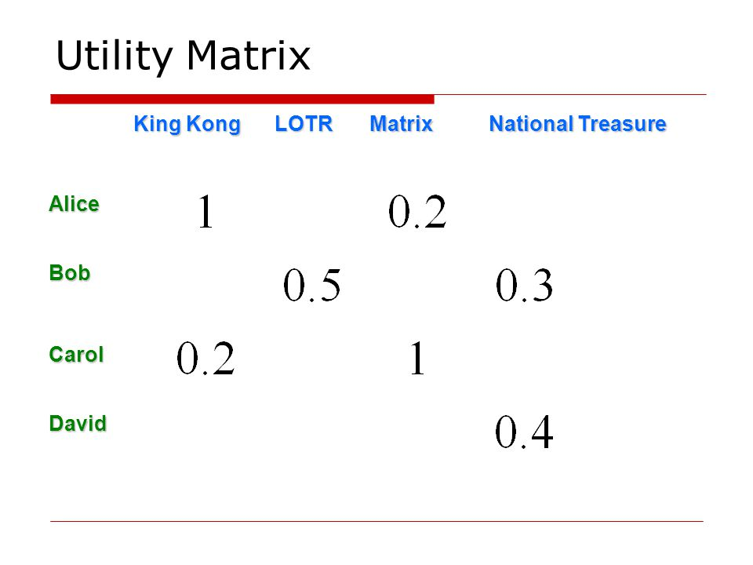
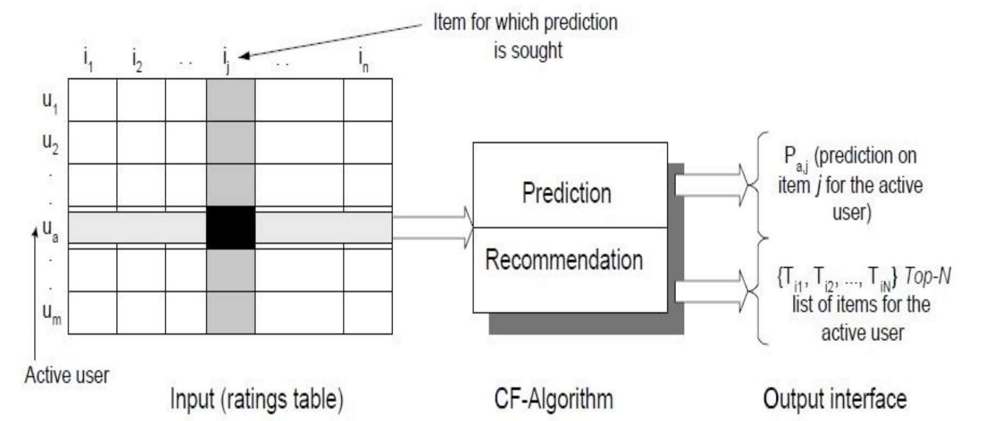
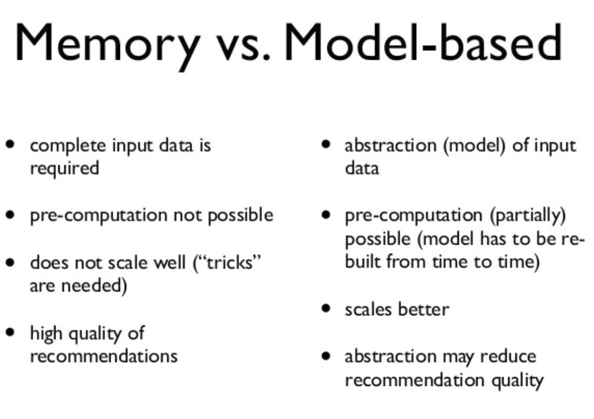
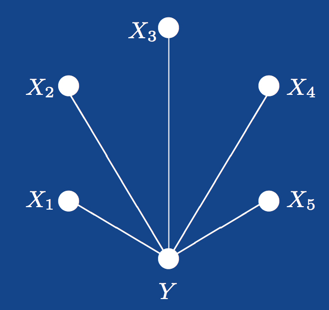
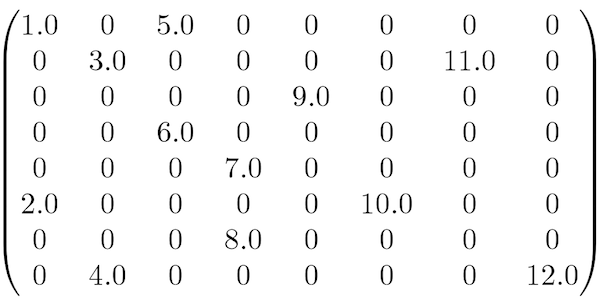
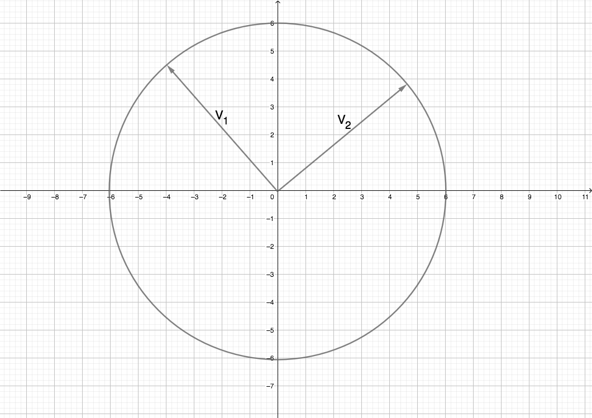
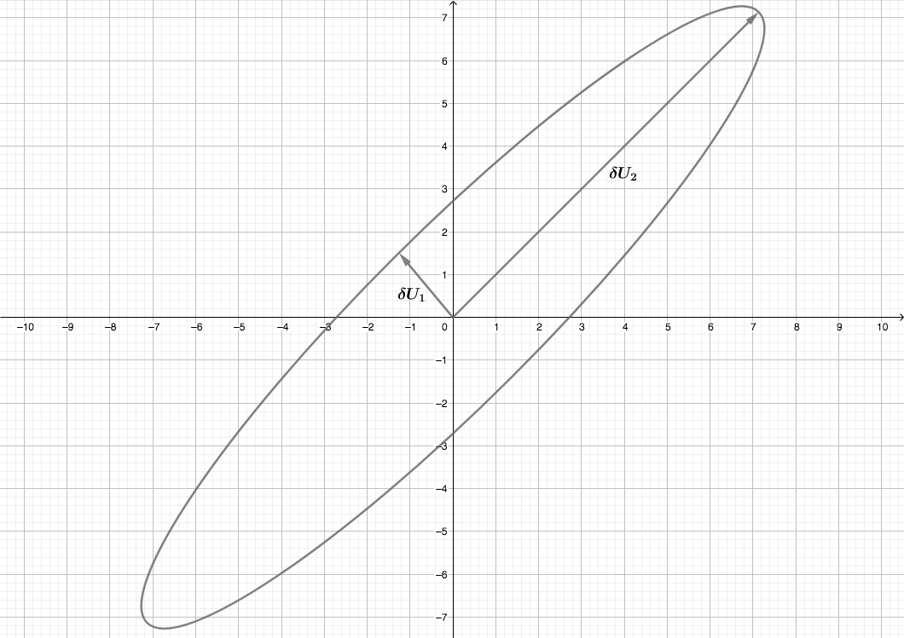

# Collaborative Filtering with Singular Value Decomposition

## Introduction

Recommendation Systems apply IR (Information Retrieval techniques) to select some information relevant to a given user. __Collaborative Filtering (CF)__ is currently most widely used approach to build recommendation systems and uses the users’ behavior in form of user-item ratings for predictions. CF uses __Matrix Factorization (MF)__ under the hood. In this lesson, we will look at an overview on the role of MF model to address the implementation of CF with __Singular Value Decomposition (SVD)__.

## Objectives
You will be able to:
- Understand collaborative filtering and how it differs from other simpler approaches 
- Describe the problem of developing a recommendation system using matrix factorization
- Develop an intuition around how SIngular Value Decomposition can be used to predict unknown values in a utility matrix
- Practice SVD in python and SciPy

## Collaborative Filtering

> Collaborative filtering is the process of filtering for information or patterns using techniques involving collaboration among multiple agents, viewpoints, data sources, etc.

In more general terms, collaborative filtering is a method of making automatic predictions (i.e. filtering) about the interests of a user by collecting preferences or taste information from many users (i.e. collaborating). 

__The key idea behind CF is that similar users share the same interest and that similar items are liked by a user__.

Assume there are some users who have bought certain items, we can use a matrix with size $num_users*num_items$ to denote the past behavior of users. Each cell in the matrix represents the associated opinion that a user holds. For instance, $M_{i, j}$ denotes how user $i$ likes item $j$. Such matrix is called __Utility Matrix__, as the example shown below:




___CF is filling the blank (cell) in the utility matrix that a user has not seen/rated before based on the similarity between users or items___. 

Users' opinions can be explicit or implicit as we saw earlier. Explicit opinion is more straight-forward than the implicit one as we do not need to guess its meaning. For instance, there can be a movie that a user would likes very much. His watching behavior (implicit indicates) that we watched the full movie without pauses, but he could actually be busy doing something else while the movie was playing. Without explicit opinion (i.e. a rating/stars), we cannot be sure whether the user dislikes that item or not. However, most of the feedback that we collect from users are implicit. Thus, handling implicit feedback properly is very important too. 


Above image shows an example of predicting of the user's rating using collaborative filtering. At first, people rate different items (like videos, images, games). After that, the system is making predictions about user's rating for an item, which the user hasn't rated yet. These predictions are built upon the existing ratings of other users, who have similar ratings with the active user. For instance, in our case the system has made a prediction, that the active user won't like the video.[WIKI](https://en.wikipedia.org/wiki/Collaborative_filtering)

Earlier we saw that there are two types of CF. 

- User-based: measure the similarity between target users and other users
- Item-based: measure the similarity between the items that target users rates/ interacts with and other items


## Collaborative Filtering Process


The task of CF algorithm is to find an item likeliness that can be described by diagram of CF process shown above. 

Looking at the process, We have an active user $u_a$ and we have to present a recommendation for item $i_j$. Our key tasks for CF here would be:

- Predict a numerical value $P_{aj}$ expressing the predicted score of an item $j$ for the user $a$. The predicted value should be  within the same scale that is used by all users for rating (i.e. number of stars or rating between 0-5)

- Recommend a list of Top-N items that the active user will like the most

## Memory-Based vs. Model-Based Collaborative Filtering 

One big distinction between CF algorithms is that of memory-based algorithms and model-based algorithms. The basic difference is that memory-based algorithms uses all the data all the time to make predictions, whereas model-based algorithms use the data to learn/train a model which can later be used to make predictions. This means that the memory-based algorithms generally should have all data in memory, whereas model-based can make fast predictions using less data than the original (once you build the model). Here is a quick comparison between the two.



We will now look at How Matrix Factorization/Decomposition can help us solve the problem of developing a model based approach to find the values for unknown cells (i.e. predict rating of a movie for a new user) of our utility matrix.

## Matrix Factorization (MF)

Most of the MF models are based on the __Latent Variable Model__. 

### Latent Variable Model 

> __Latent variable models attempt to explain complex relations between several variables by simple relations between the variables and an "underlying unobservable", i.e. latent structure.__

Formally we have a collection $X = (X1, . . . , Xp)$ of __manifest__ (observable) variables, and a collection $Y = (Y1, . . . , Yq)$ of __latent__ variables which are unobservable, yet ‘explain’ the dependence relationships between the manifest variables. Here ‘explaining’ means that the manifest variables are assumed to be conditionally independent given the latent variables. 


Here $Y$ is the latent variable and there are 5 manifest variables $X1, . . . , X5$.
For the model to be useful, $q$ must be much smaller than $p$. Data available to us will be repeated observations of the vector $X = (X1, . . . , Xp)$ of manifest variables.


Matrix Factorization approach is found to be most accurate approach to reduce the problem from high levels of  sparsity in RS database as all users do not buy all products and services and our utility matrix remains highly sparse.  In the model-based recommendations,  techniques like __Latent Semantic Index (LSI)__,  and the dimensionality reduction method __Singular Value Decomposition (SVD)__ are typically combined to get rid of sparcity. Below is an example of sparse matrix , which can lead to problems highlighted earlier in the PCA section. 


Let's look at how a recommendation problem can be translated into matrix decomposition context. The idea behind such models is that preferences of a users can be determined by a small number of hidden factors. We can call these factors as Embeddings.


### Embeddings:
Embeddings are __low dimensional hidden factors__ for items and users. 

For e.g. say we have 5 dimensional (i.e. D or n_factors = 5 in above figure) embeddings for both items and users (5 chosen randomly, this could be any number - as we saw with PCA and dim. reduction). 

For user-X & movie-A, we can say the those 5 numbers might represent 5 different characteristics about the movie e.g.:

- How much movie-A is sci-fi intense 
- How recent is the movie 
- How much special effects are in movie A 
- How dialogue driven is the movie 
- How CGI driven is the movie.

In a similar way, 5 numbers in user embedding matrix might represent:
- How much does user-X like sci-fi movie 
- How much does user-X like recent movies … and so on. You get the idea.

In above figure, a higher number from dot product of user-X and movie-A matrix means that movie-A is a good recommendation for user-X.

SVD and PCA are popular technique for identifying latent factors in the field of Information Retrieval to deal with CF challenge of sparsity. These methods have become popular recently by combining good scalability with predictive accuracy. They offers much flexibility for modeling various real-life applications. We have already seen how PCA works , here we will look at SVD approach.
### Matrix decomposition can be reformulated as an optimization problem with loss functions and constraints.


## Singular Value Decomposition

__Singular-Value Decomposition__, or SVD is a common and widely used matrix decomposition method . All matrices have an SVD, which makes it more stable than other methods, such as the eigendecomposition. As such, it is often used in a wide array of applications including compressing and data reduction.

In simple terms, SVD is the factorization of a matrix into 3 matrices. So if we have a matrix A, then its SVD is represented by equation:

$$ A = U\Sigma V^T$$

Where $A$ is an $n x d$ matrix, $U$ is an $(n x r)$ orthogonal matrix, $𝚺$ is an $(r x r)$ nonnegative rectangular diagonal matrix, and $V$ is an $(r x d)$ orthogonal matrix.
$U$ is also referred to as the __left singular vectors__, 𝚺 the __singular values__, and V the __right singular vectors__. 

This decomposition can be viewed in following illustration:


Let’s see how this comes about. Imagine a circle in two dimensions represented by vectors V1 and V2 undergoing a matrix transformation as illustrated on the cartesian coordinates below:


After applying a transformation through matrix multiplication, we can stretch and/or rotate this circle as shown below:



So if we generalize this from just two dimensions to n-dimensions, the vector space $V_1, V_2, .., V_n$ becomes $U_1, U_2, .., U_n$. After multiplication we have $\sigma_1, \sigma_2 , .., \sigma_n$ as our __Stretching factors__, shown i nthe second diagram above. So we can now write the equation:

$$AV_n = \sigma_n U_n$$

Or more generally, 
$$AV = U\Sigma$$ 

Here capital sigma ($\Sigma$) is the combination of all lowercase sigmas ($\sigma$) and gives us the __space of all stretching factors__. 

- For an orothoganl matrix $$V^{-1} = V^T$$

Here is [quick reference](https://en.wikipedia.org/wiki/Orthogonal_matrix) for this. 

- We also knw that hat the product of a matrix and its inverse is the identity matrix (An identity matrix is a diagonal matrix with only 1's) i.e. $$VV^{-1} = 1$$.

Combining above three equations we get

$$A = U\Sigma V^T$$

Where $V$ is a rotation, $𝚺$ a stretching and $U$ another rotation. Also, the entries of $U$ are the principle axis while $𝚺$ are the singular values.

This is how you can decompose a matrix into three lower rank matrices.  

> __SVD decreases the dimension of the utility matrix by extracting its latent factors.__ 

Essentially, we map each user and each item into a latent space with lower dimension. Therefore, it helps us better understand the relationship between users and items as they become directly comparable. 


### SVD and Recommendations

With SVD, we turn the recommendation problem into an __Optimization__ problem that deals with how good we are in predicting the rating for items given a user. One common metric to achieve such optimization is __Root Mean Square Error (RMSE)__.A lower RMSE is indicative of improved performance performance and vice versa. RMSE is minimized on the known entries in the utility matrix. SVD has a great property that it has the minimal reconstruction Sum of Square Error (SSE); therefore, it is also commonly used in dimensionality reduction. Below is the formula to achieve this:

$$min_{UV\Sigma}\sum_{i,j∈A}(A_{ij} - [UV\Sigma^T]_{ij})^2$$


RMSE and SSE are monotonically related. This means that the lower the SSE, the lower the RMSE. With the convenient property of SVD that it minimizes SSE, we know that it also minimizes RMSE. Thus, SVD is a great tool for this optimization problem. To predict the unseen item for a user, we simply multiply U, Σ, and T.


### SVD in Python

Scipy has a straightforward implementation of SVD to help us avoid all the complex steps of SVD. We can use `svds()` function to decompose a matrix as shown below. We ill use `csc_matrix()` to create a sparse matrix object. 


```python
from scipy.sparse import csc_matrix
from scipy.sparse.linalg import svds

# Create a sparse matrix 
A = csc_matrix([[1, 0, 0], [5, 0, 2], [0, -1, 0], [0, 0, 3]], dtype=float)

# Apply SVD
u, s, vt = svds(A, k=2) # k is the number of stretching factors

print ('A:\n', A.toarray())
print ('=')
print ('\nU:\n', u)
print ('\nΣ:\n', s)
print ('\nV.T:\n', vt)
```

    A:
     [[ 1.  0.  0.]
     [ 5.  0.  2.]
     [ 0. -1.  0.]
     [ 0.  0.  3.]]
    =
    
    U:
     [[ 1.73323831e-01  1.56782328e-01]
     [ 2.27856346e-01  9.54078802e-01]
     [ 8.33818732e-17  1.75584189e-17]
     [-9.58144214e-01  2.55250744e-01]]
    
    Σ:
     [2.75193379 5.6059665 ]
    
    V.T:
     [[ 4.76975707e-01 -2.29461394e-16 -8.78916478e-01]
     [ 8.78916478e-01 -9.84319084e-17  4.76975707e-01]]


With this simple example, consider A as the __utility matrix__ with users and products links. 

After the decomposition U will be the "__user features__" matrix, Σ will be the diagonal matrix of singular values (essentially __weights__), and V.T will be the "__movie features__" matrix. 

U and V.T are orthogonal, and represent different things. U represents how much users like each feature and 
V.T represents how relevant each feature is to each movie.

---

Above account provides you a brief summary of Collaborative Filtering , matrix factorization with SVD and relating this to a real life problem, like recommending a movie or a song. Next, we shall look at implementing a simple recommendation system in Python to further strengthen our intuition around this idea. 

## Additional Reading

- [What is collaborative filtering](https://www.upwork.com/hiring/data/how-collaborative-filtering-works/)
- [Singular Value Decomposition](https://hadrienj.github.io/posts/Deep-Learning-Book-Series-2.8-Singular-Value-Decomposition/) - An excellent article for developing a geometrical intuition for SVD.
- [Mathematical formulas and derivation for SVD](http://math.mit.edu/classes/18.095/2016IAP/lec2/SVD_Notes.pdf)
- [Matrix Factorization for Collaborative Prediction](http://cs229.stanford.edu/proj2006/KleemanDenuitHenderson-MatrixFactorizationForCollaborativePrediction.pdf)


## Summary 
In this lesson, we looked at collobartove filtering approach using Singular value Decomposition. We looked at how a recommendation  problem can be translated into a matrix decomposition problem and solved by reducing the number of dimensions, calculating stretching factors. Next we shall see how to develop a recommendation system from real world data. 
